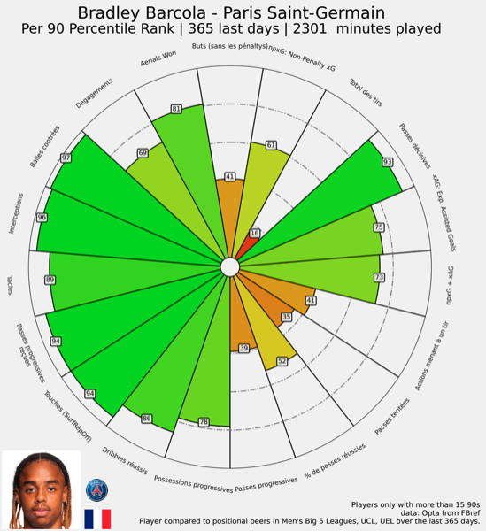

# TellMeMoreAbout


[](https://github.com/myscale/myscaledb/blob/main/LICENSE)
[](https://isocpp.org/)
[](https://twitter.com/)


Ce projet est un projet open source, qui a pour but de mettre en évidence des indicateurs de performance 
clés chez les joueurs de football.

L'**objectif principal** à terme est de pouvoir établir des rapports comparatifs des différents joueurs référencés. 

L'**objectif secondaire** est de proposer par une approche de clustering un panel de joueurs à profil fortement 
similaires en prenant en compte des paramètres de recherche *(fourchette d'âge, valeur marchande, championnat, KPI etc.)*.  

L'objectif pour les contributeurs de ce projet est de mettre à profit leurs compétences autour d'un projet orienté 
football, en parfaisant leurs compétences techniques, le tout en collaborant avec d'autres 
passionnés de la communauté sport technologies. 

Les idées pour orienter le projet sont les naturellement les bienvenues.

Pour les contributions, n'hésitez pas à regarder les besoins dans les 
**[Issues](https://github.com/giovannimin/TellMeMoreAbout/issues)** de ce repositories.

### Pour commencer
Pour utiliser ce projet en local :
- Cloner ce repositories avec la commande

```markdown
    git clone https://github.com/giovannimin/TellMeMoreAbout.git
```

### Pré-requis
Pour installer les dépendances de ce projet :

```markdown
    pip install requirements.txt
```

### Utilisation
Ce projet est destiné à être utilisé via différents modes :
- Une [API](./src/api/app.py) mise a disposition 

```markdown
    curl -o path/${player_name}_report.png -X GET http://localhost:8000/status/${player_name}
```

- Une utilisation locale via la CLI 

```markdown
    python3 ./src/main.py $player_name
```

- Une application executable avec Docker 

```markdown
    docker-compose -f TellMeMoreAbout/docker_app/docker-compose.yml up --build
```

- Une utilisation automatisée contrôlée par des bots [X | Twitter](https://twitter.com)

### Exemple d'utilisation
Voici un exemple d'utilisation de l'application : 
#### Requête
Pour cet exemple, nous allons requêter le rapport comparatif de [Bradley Barcola](https://fbref.com/en/players/a0d55a09/Bradley-Barcola), en ne spécifiant que son nom comme argument pour la requête. 

- API :

```markdown
    curl -o barcola_report.png -X GET http://localhost:8000/status/$barcola
```

- CLI : 

```markdown
    python3 ./src/main.py $barcola
```

#### Objet
Le comportement de l'application est le suivant : 
```markdown
UserWarning: Exact match for barcola not found.
    Setting `player_name` to first search result: Bradley Barcola  Maybe `player_name` could be one of them ['Malcolm Barcola']
warnings.warn(msg)
```
Pour cette requête une alerte est levée dans le cas où il y a une confusion sur le paramètre d'entrée.
Dans ce cas, la recherche sélectionne le plus probable, ici Bradley Barcola, 
en précisant avoir aussi trouvé d'autres correspondances ['Malcolm Barcola']. 

L'objet crée est unique et identifié par nom complet, slug_id et id.
```markdown
<player: Bradley Barcola, slug_id: a0d55a09, id: 140602241202592>
```


L'objet contient les attributs suivants : 

```python
{'name': 'Bradley Barcola',
'_url_page': 'https://fbref.com/en/players/a0d55a09/Bradley-Barcola',
'_standard_tables': None,
'_scouting_url': 'https://fbref.com/en/players/a0d55a09/scout/365_m1/Bradley-Barcola-Scouting-Report',
'_scouting_tables': None,
'slug_id': 'a0d55a09',
'infos': {'complete_name': 'Bradley Barcola',
'country': 'fr',
'country_img': 'https://cdn.ssref.net/req/202403271/flags/fr-2002.svg',
'img': 'https://fbref.com/req/202302030/images/headshots/a0d55a09_2022.jpg',
'club_img': 'https://cdn.ssref.net/req/202312151/tlogo/fb/e2d8892c.png',
'club': 'Paris Saint-Germain',
'age': 21,
'position': 'FW-MF',
'footed': None,
'weight': '63',
'height': '188'},
'img': 'https://fbref.com/req/202302030/images/headshots/a0d55a09_2022.jpg',
'country_img': 'https://cdn.ssref.net/req/202403271/flags/fr-2002.svg',
'club_img': 'https://cdn.ssref.net/req/202312151/tlogo/fb/e2d8892c.png',
'position': 'FW-MF',
'height': '188',
'weight': '63',
'age': 21,
'club': 'Paris Saint-Germain',
'country': 'fr',
'footed': None,
'complete_name': 'Bradley Barcola',
'minutes_played': '2301 '}
```

#### Output
Enfin, l'output de la requête est renvoyé dans le dossier [./outputs](./outputs) 
ou dans le chemin spécifié lors de la requête curl sous format .png. 



La figure ci-dessus est exprimée en centiles. Elle ordonne l'ensemble 
des joueurs d même poste évoluant dans l'un des 5 grands championnats. 
Les indicateurs sont normalisés par le temps.

*(ie. Parmi tous les attaquants de cotés évoluant dane le Big5,
Bradley Barcola remporte plus de duels aériens par 90 min de jeu, 
que 82% des joueurs de ce panel.)*

### Sources des données
Les données utilisées sont issus de méthodes de scrapping. Les sources utilisées sont :
- **[FBRef](https://fbref.com/)** 
- **[TransferMarkt](https://www.transfermarkt.fr/)**

Les autres sources sont les bienvenues, que ce soit à partir d'API ou de données scrappées. 


### Automatisation 
L'ensemble des actions automatisées sont recensés sur cette section. 
Vous pourrez les trouver dans le repertoire 
[workflows](https://github.com/giovannimin/TellMeMoreAbout/tree/main/.github/workflows). 
- [test.yml](https://github.com/giovannimin/TellMeMoreAbout/tree/main/.github/workflows/test.yml), 
cette action exécute l'ensemble des tests unitaires pytests lors de chaque push sur la branche principale. 
- 

### Tests unitaires
Les tests unitaires sont exécutés automatiquement lors de chaque push sur la branche principale et les logs ajoutés dans le volume monté sur le conteneur. 
Pour les exécuter manuellement :

```markdown
python3 -m pytest tests/
```

N'hésitez pas à ajouter progressivement les tests unitaires des nouvelles fonctionnalités que vous ajoutez. 


### Contributions

Le projet accueille avec plaisir votre expertise et votre enthousiasme !
Les petites améliorations ou corrections sont toujours appréciées.
N'hésitez pas à soumettre de nouvelles idées de fonctionnalités. 

Pour contribuer au projet **[TellMeMoreAbout](https://github.com/giovannimin/TellMeMoreAbout)**. Vous pouvez :
- Examiner les demandes de **[Pull request](https://github.com/giovannimin/TellMeMoreAbout/pulls)**
- Prendre en charge les **[Issues](https://github.com/giovannimin/TellMeMoreAbout/issues)**
- Nous aider à maintenir les outils de ce projet 


Pour plus d'informations sur les façons dont vous pouvez contribuer à ce projet n'hésitez pas à poser des questions 
sur GitHub, en ouvrant une **[New Issue](https://github.com/giovannimin/TellMeMoreAbout/issues/new)** ou en laissant un message via la **[Discussion](https://github.com/giovannimin/TellMeMoreAbout/discussions/1)**.


Si vous avez besoin de plus d'informations sur les contributions open-source,
**[ce guide](https://opensource.guide/how-to-contribute/)** explique pourquoi et comment vous impliquer.


### Licence
[Apache License 2.0](license)


